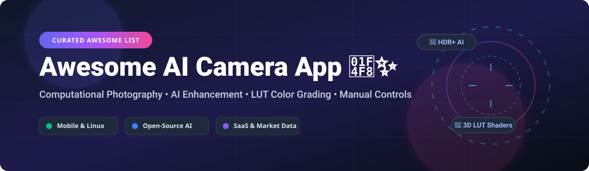

  

# 📸 Awesome AI Camera App ✨

  
  
  
  

> **A curated showcase of commercial AI camera apps, computational photography tools, LUT color grading engines, and open-source vision frameworks for iOS, Android, and Linux.** 🚀

---

## 💡 Overview & Market Insights

The estimated global market size for AI photography & mobile camera applications is **$15.2 Billion**, projected to reach **$38.4 Billion by 2030** (CAGR 14.3%). 

📈 **Market Structure**: The sector is **moderately fragmented**, featuring giant tech incumbents (Google, Apple) alongside specialized boutique studio platforms (Lux Optics, Prisma Labs, VSCO). While native OS camera apps dominate default usage, high-end manual controls and niche AI style/avatar generation enable independent SaaS vendors and open-source projects to thrive.

---

## 📂 Table of Contents

- [💼 Commercial & SaaS Camera Apps](#-commercial--saas-camera-apps)
- [🔓 Open-Source Projects](#-open-source-projects)
- [🤝 How to Contribute](#-how-to-contribute)
- [💖 Support & Sponsorship](#-support--sponsorship)
- [📈 Star History](#-star-history)
- [⚠️ Disclaimer](#%EF%B8%8F-disclaimer)

---

## 💼 Commercial & SaaS Camera Apps

Below is a detailed breakdown of leading commercial AI camera apps, ranked by estimated company size, valuation, and revenue metrics:

| App Name 📱 | Primary Focus & Features 🎯 | Pricing Tier 💳 | Free Tier / Trial Limits ⏳ | Company Valuation / Revenue Size 📊 |
| :--- | :--- | :--- | :--- | :--- |
| **[Google Camera](https://play.google.com/store/apps/details?id=com.google.android.GoogleCamera)** | Flagship computational photography (HDR+, Night Sight, Astrophotography, Magic Eraser) | Free pre-installed on Google Pixel hardware | Unlimited free access on supported Pixel devices | **$2.15 Trillion** Market Cap (Alphabet Inc.) |
| **[Lensa AI](https://prisma-ai.com/lensa)** | AI photo editing, retouching, and Magic Avatar generation | $4.99/week or $29.99/year subscription | 7-day free trial (limits avatar downloads without credits) | **$100M+** ARR Peak (Prisma Labs) |
| **[VSCO](https://vsco.co/)** | Professional film emulation presets, LUT color grading, and creator community | $29.99/year VSCO Plus membership | Free basic version with limited film presets & basic edit tools | **$550M** Valuation ($35M+ ARR) |
| **[Prisma](https://prisma-ai.com/)** | Neural style transfer AI filters transforming photos into artwork | $7.99/month or $29.99/year subscription | Free tier available (SD exports, limited filter catalog) | **$100M+** Valuation (Prisma Labs) |
| **[Focos](https://focos.app/)** | Computational portrait depth map editing, large aperture bokeh simulation | $3.99/month, $12.99/year, or $39.99 lifetime | Free download with basic focus adjustment (Pro features locked) | **$15M+** Estimated Valuation (Antechinus/Appsys) |
| **[Camera+](https://camera.plus/)** | Manual exposure/ISO controls, RAW capture, depth shooting, and macro mode | $4.99/month or $19.99/year subscription | 7-day free trial with full feature access | **$10M+** Total Revenue (LateNiteSoft) |
| **[Halide](https://halide.cam/)** | Premium manual camera for iPhone with RAW/ProRAW, focus peaking, & Process Zero | $2.99/month, $19.99/year, or $69.99 lifetime | 7-day free trial (requires annual membership sign-up) | **$10M+** Valuation (Lux Optics, target of Apple acquisition talks) |
| **[Spectre Camera](https://spectre.cam/)** | AI-driven long exposure capture, light trails, and background crowd removal | $4.99 one-time upfront purchase | No free tier or trial (Paid app only) | **$5M+** Estimated Revenue (Lux Optics) |
| **[ProCam](https://procamapp.com/)** | Professional camera replacement with 4K video, time-lapse, and manual shooting | $9.99 one-time purchase + optional add-on packs | No free tier (Paid app download) | **$5M+** Estimated Revenue (Samer Azzam) |

---

## 🔓 Open-Source Projects

Production-ready open-source camera apps, AI avatar generators, webcam filters, and image pipelines, sorted by **GitHub Stars_Count (Descending)** 🌟:

1. **[comfyanonymous/ComfyUI](https://github.com/comfyanonymous/ComfyUI)**  
     
   **Modular node-based GUI for AI image/video generation.** Advanced visual graph pipeline editor for Stable Diffusion, FLUX, and real-time AI camera workflows.

2. **[KwaiVGI/LivePortrait](https://github.com/KwaiVGI/LivePortrait)**  
     
   **Efficient portrait animation with stitchable and controllable motion.** Real-time expression transfer from driving video onto static avatar photos.

3. **[scikit-image/scikit-image](https://github.com/scikit-image/scikit-image)**  
     
   **Image processing library in Python.** Foundational open-source algorithms for filtering, edge detection, color transformation, and feature extraction.

4. **[android/camera-samples](https://github.com/android/camera-samples)**  
     
   **Official Google Android Camera2 and CameraX samples.** Essential reference implementations for building modern high-performance camera applications.

5. **[wuhaoyu1990/MagicCamera](https://github.com/wuhaoyu1990/MagicCamera)**  
     
   **Real-time GPU-accelerated filter camera for Android.** Features real-time filter previews, video recording, image editing, and custom shading.

6. **[resemble-ai/Resemble-Enhance](https://github.com/resemble-ai/Resemble-Enhance)**  
     
   **AI speech enhancement and noise reduction engine.** Complements AI video/camera applications with studio-grade audio restoration.

7. **[jashandeep-sohi/webcam-filters](https://github.com/jashandeep-sohi/webcam-filters)**  
     
   **Background blur and virtual video filters for Linux webcams.** Lightweight Python application connecting camera streams with OpenCV filters.

8. **[bjzhou/PhotonCamera](https://github.com/bjzhou/PhotonCamera)**  
     
   **Advanced open-source Android camera app for static photography.** Features 3D LUT support (`.cube`, `.png`), MiDaS v2 AI bokeh, motion photos, and multi-frame noise reduction.

9. **[funinkina/openeffects](https://github.com/funinkina/openeffects)**  
     
   **ONNX-powered Linux webcam effects engine.** Delivers portrait background blur, auto-framing, studio light adjustment, and gesture reactions for PipeWire streams.

10. **[302ai/302_avatar_maker](https://github.com/302ai/302_avatar_maker)**  
      
    **AI avatar generator web application.** Converts portrait photos into 17+ artistic styles using Next.js 14 and open diffusion models.

11. **[Particlo/camataca](https://github.com/Particlo/camataca)**  
      
    **Full-parameter Android camera control app.** Provides raw low-level camera parameter access, multi-camera switching, BT2020 color spaces, and AVIF/JXL export.

12. **[m0cal/LutinLens](https://github.com/m0cal/LutinLens)**  
      
    **AI composition guide and GPU LUT renderer.** Built with Flutter, GLSL shaders, and NVIDIA NeMo agent protocols for smart scene feedback.

13. **[Marcus-torchline/SnapOtter-Vespera](https://github.com/Marcus-torchline/SnapOtter-Vespera)**  
      
    **Self-hosted image toolkit with 50+ local AI microservices.** Docker-based suite for background removal, upscaling, restoration, and REST API automation.

---

## 🤝 How to Contribute

Contributions are always welcome! 🛠️

1. **Fork** the repository 🍴
2. **Create** a new feature branch (`git checkout -b feature/amazing-camera-app`)
3. **Add/Update** your entry in `README.md` following the table or list format.
4. **Commit** your changes (`git commit -m 'Add Amazing AI Camera App'`)
5. **Push** to the branch (`git push origin feature/amazing-camera-app`)
6. **Open** a Pull Request 🚀

---

## 💖 Support & Sponsorship

If you found this curated list helpful for your mobile photography setup, AI development, or research, please consider supporting the project! ⭐

- **Star** this repository to show your appreciation! 🌟
- **Fork** and share it with your fellow developers and creators! 📢
- **Sponsor**: Buy me a coffee or support ongoing maintenance via [GitHub Sponsors](https://github.com/sponsors/ishandutta2007). ☕

Your support keeps this repository updated and maintained. Thank you! 🙏

---

## 📈 Star History

---

## ⚠️ Disclaimer

- This is a **community-curated** repository provided for educational and informational purposes only.
- AI camera applications process media and potential biometric data (face structures, selfies); ensure compliance with local privacy regulations (GDPR, CCPA) before processing sensitive image data.
- All product names, logos, and brands are property of their respective owners.

---

  <b>Made with ❤️ for mobile photographers, Android power users, Linux enthusiasts, and AI vision engineers.</b>

